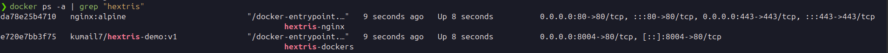
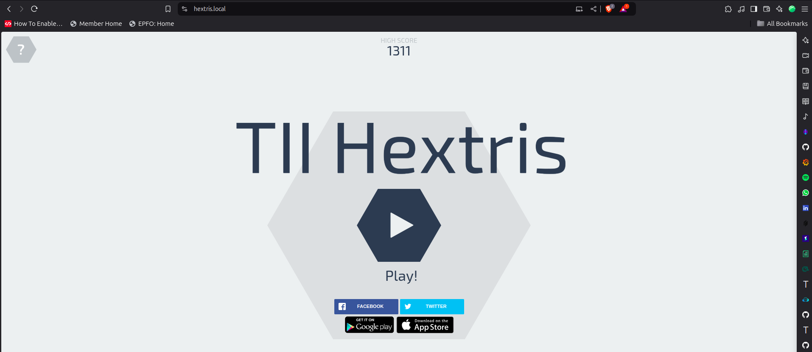
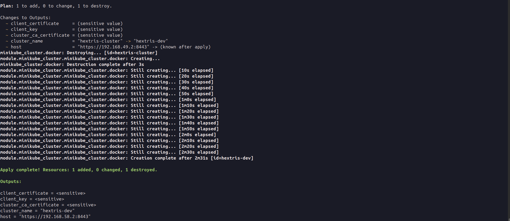
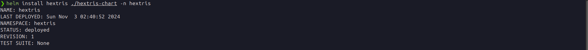
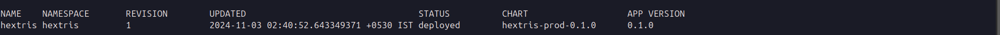
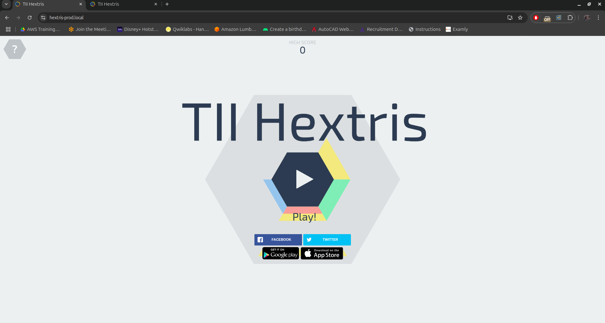
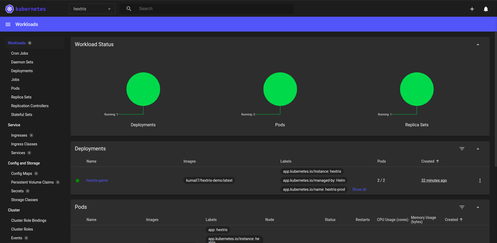

Hextris (TII - Technical Assessment)
==========

<br>

An addictive puzzle game inspired by Tetris. Play it [https://hextris.github.io/hextris](https://hextris.github.io/hextris).

This Game has been deployed in 3 ways:

- **[Docker Container with nginx and SSL](#1-docker-container-with-nginx-and-ssl)**
- **[Deloying on Kubernetes Cluster](#4-deploying-on-kubernetes-cluster)**
- **[Deploying as Helm Chart](#6-deploying-of-helm-charts-on-kuberentes-cluster)**

## Hextris Game Deployment with Docker , Kubernetes and Helm Chart
This project demonstrates the deployment of the Hextris game using Docker, Kuberentes , and Hlem charts with NGINX as a reverse proxy. The mainkube cluster is created via terraform. It includes setting up a local domain (`hextris-prod.local` , `hextris.local`) secured with an SSL certificate generated by Mkcert.

## Prerequisites

1. **Docker**: Ensure Docker is installed on your system. [Docker Installation Guide](https://docs.docker.com/get-docker/)
2. **Docker Compose**: Make sure Docker Compose is available. [Docker Compose Installation Guide](https://docs.docker.com/compose/install/)
3. **Mkcert**: Used for generating local development SSL certificates. [Mkcert Installation Guide](https://github.com/FiloSottile/mkcert)
4. **Minikube**: A tool that makes it easy to run Kubernetes locally.  
   [Minikube Installation Guide](https://minikube.sigs.k8s.io/docs/start/)

5. **Kubectl**: The command-line tool for interacting with Kubernetes clusters.  
   - You can install kubectl by following the official guide:  
     [Install and Set Up kubectl](https://kubernetes.io/docs/tasks/tools/install-kubectl/)

6. **Helm**: A package manager for Kubernetes, useful for managing Kubernetes applications.  
   - Install Helm by following the official guide:  
     [Helm Installation Guide](https://helm.sh/docs/intro/install/)

7. **Terraform**: To Manage Infrastrcture as code , Managing Creation of kubernetes cluster
    - To install Terraform detailed installation instructions can be found in the [Terraform Installation Guide](https://learn.hashicorp.com/tutorials/terraform/install-cli).

## Project Structure

The repository is organized as follows:

```plaintext
.
├── docker-compose.yml            # Docker Compose configuration 
├── nginx/
│   ├── nginx.conf                # NGINX configuration file
│   ├── certs/                    # Directory for SSL certificates
│       ├── hextris.local.pem     # SSL certificate for local domain
│       └── hextris.local-key.pem # SSL key for local domain
| dockerfile                      # application dockerfile
| terraform-minikube              # Terraform files to create minikube cluster 
| makefile                        # Automate process for terrfrom init , plan and apply 
| K8s                             # Kubernetes manifests files 
| hextris-chart                   # Helm chart for deploying on K8s
| src                             # Application code 
```


## Configuration

## 1. Docker Container with nginx and SSL

**Step 1: Created Dockerfile for the Application.**

- Created Dockerfile for the Application. As this is an HTML5-based application, i have used NGINX to serve it.

- Check the Dockerfile for the configuration [Dockerfile](dockerfile)


**Step 2: Configure NGINX as a Reverse Proxy**

- Create an NGINX configuration file in a new directory `nginx/` for the reverse proxy.

**Note: Here i have used local domain**

- An example nginx.conf 

```
server {
    listen 80;
    server_name your-domain.local;

    location / {
        root /usr/share/nginx/html;
        index index.html;
    }
}
```

- Check the `nginx.conf` for the configuration [nginx.conf](nginx/nginx.conf)

- The configuation is updated with SSL but later will see how to get SSl certs for the local domain.


**Step 3: Creating docker image and pushing to Container Registry**

- Created a docker image with proper version tagging 
  
```
docker build -t kumail7/hextris-demo:v1 . 
```

**Note: Docker login is important in order to push it**

```
docker login -u <username>
```


- Pushed it to the docker container registry 

```
docker push kumail7/hextris-demo:v1
```

**Step 4: Running the docker contaniers**

- Updated the docker compose file with proper image name and tag

- Check the `docker-compose.yml` for the configuration [docker-compose.yml](docker-compose.yml)

- Running the docker compose 

```
docker compose up -d
```

- Output after runnig the command:



**IMPORTANT: As i am running it locally it is important to map the DNS at `/etc/hosts` by adding `127.0.0.1` to `hextris.local`**

Domain used for Docker: **hextris.local**

- On `http://hextris.local` URL on broswer the game is accessible , But the site is unsecured .

**Step 5: Adding SSL cert to the site**

- I have created SSL certs using mkcert 

```
mkcert hextris.local
```

- So it will created two files `hextris-local-key.pem` and `hextris.local.pem`  

- Added those files under `nginx/certs` and also update the `nginx.conf` for SSL

```conf
    ### Updating configuration with SSL #####

    ssl_certificate /etc/nginx/certs/hextris.local.pem;
    ssl_certificate_key /etc/nginx/certs/hextris.local-key.pem;
```

- After updating `nginx.conf` i have updated `docker-compose.yml` file 

```yml
volumes:
        - ./nginx/nginx.conf:/etc/nginx/conf.d/default.conf
        - ./nginx/certs:/etc/nginx/certs
```

- After updating rerun the docker compose and then the domain is now secured with SSL 




## Important Notes

- **Security**: Certificates and keys are not pushed to GitHub as it's not recommended to share sensitive information publicly.
- **Code Changes**: The source code has been modified to make it more assessment-oriented.


## 2. Creating Local Development Cluster via Terraform 

**Step 1: Choosing right environment for development cluster**

- Here i have used `minikube` cluster as devlopment environment.

**Step 2: Creating Terraform files for Cluster**

- Created Terraform files and made its into modules based for better managment and reuseablity

- For Configuration please check : [Terraform Config](terraform-minikube)

- Created `Makefile` to automate the terrform init, plan and apply process

**Step 3: Creating the minikube cluster**

- Initate the Terrform config

```
terraform init
```

- Running the plan of the IAC 
  
```
terraform plan -out=tfplan --var-file="dev.tfvars"
```

- Applying the config

```
terraform apply --var-file="dev.tfvars --auto-approve
```

Output of Terraform apply 




## 3. Acessing Kuberentes Cluster and Deploying manifests

**Step 1: Accessing the Cluster**

- First running minikube profile list to check the cluster 

 

- Set the profile 
```
minikube profile hextris-dev
✅  minikube profile was successfully set to hextris-dev
```

- Access the cluster via running the command:

```
kubectl get nodes -o wide 
NAME          STATUS   ROLES           AGE   VERSION   INTERNAL-IP    EXTERNAL-IP   OS-IMAGE             KERNEL-VERSION     CONTAINER-RUNTIME
hextris-dev   Ready    control-plane   24m   v1.30.0   192.168.58.2   <none>        Ubuntu 22.04.4 LTS   6.8.0-48-generic   docker://26.1.1

```

- Checking the namespace

```
k get ns
NAME                   STATUS   AGE
default                Active   25m
ingress-nginx          Active   25m
kube-node-lease        Active   25m
kube-public            Active   25m
kube-system            Active   25m
kubernetes-dashboard   Active   25m
```


**Step 2: Deploying the manifests files on kubernetes cluster**

- Now i have deployed all the resources in the `K8s` Manifests 

- Check the configuration [K8s Manifests](K8s/)

- Also created `secrets.yml` to handle the `tls.crt` and `tls.key`

 **NOTE: The local domain for kuberentes is different than the domain used for docker contanier. To differiate two environments**

Domain used for Kubernetes: **hextris-prod.local**

- Creating new SSL for new domain 

```
mkcert hextris-prod.local
```
- After running would get two files `hextris-prod.local.pem` and `hextris-prod.local-key.pem`

- The tls.crt vaule would be value of `hextris-prod.local.pem` and tls.key value would value of `hextris-prod.local-key.pem` 


  ### **NOTE: Base Encode the Secrets to inject in `secrets.yml` of helm charts**

- Base encoded both the vaules using this command
```
cat hextris-prod.local.pem | base64 -w 0

cat hextris-prod.local-key.pem | base64 -w 0
```

- Use this Shell Script to generate secrets.yml [Create Secrets](create-k8-secret.sh)

## 4. Deploying on Kubernetes Cluster

- Created Bash Script to handle the Namespace creeation , Ingress Creation check , Deployment of all mainfests and adding minikube ip to the `/etc/hosts`

- Check the Shell Script configuration: [K8-Setup.sh](K8s/k8s-setup.sh)

- A video respentation of running this script and accessing the domain shown below 

[Kubernetes Deployment Walkthrough](https://imgur.com/a/aODYc7m)


## 5. Converting the mainfests into Helm Charts

**Step 1: Creating Helm Charts out of kubernetes files**

- Initialize the Helm Chart
```
helm create hextris-chart
```

- Check for the configurations: [Helm Charts](hextris-chart)

- Update the `values.yaml`  with Base64 encoded values of `hextris-prod.local`  [Base64 Encode](#note-base-encode-the-secrets-to-inject-in-secretsyml-of-helm-charts)

- The `Crt` vaule would be value of `hextris-prod.local.pem` and `Key` value would value of `hextris-prod.local-key.pem` in values.yml

## 6. Deploying of Helm Charts on Kuberentes cluster 

- Before deploying helm charts , its better to run a dry test to check if helm chart is valid or not

```
helm install hextris hextris-chart -n hextris --debug --dry-run
```

- where `hextris` is the **release name** and  `hextris-chart` is the chart name to be deployed 

- This will render the templates and output the generated Kubernetes resources without applying them, allowing you to catch syntax errors or inspect the rendered output.

- To unit test helm chart we can also use `unittest` plugin to test the helm chart

- Now once helm is verified , we will install in on the namespace 

- To install the helm chart we will run this command

```
helm install hextris hextris-chart -n hextris
```

- Output would be like this 



- To check if helm chart is there in kuberentes cluster, run this command 
```
helm list -A 
```

- Output would be like this 




- Check the URL `hextris-prod.local` 



- The helm chart is also packaged as well in a `tar.gz` so it easy transferable and easy for installation 
- To package the helm chart use this command

```
helm package hextris-chart
```

- Deploy the package if needed as shown below

```
helm install hextris hextris-prod-0.1.0.tgz -n hextris
NAME: hextris
LAST DEPLOYED: Sun Nov  3 03:12:41 2024
NAMESPACE: hextris
STATUS: deployed
REVISION: 1
TEST SUITE: None
```
- To uninstall a chart , run this command
```
helm uninstall hextris -n hextris
```

## 7. Monitor the cluster

- Added Kuberentes Dashboard to see the Dashboard run 
```
minikube dashboard

🤔  Verifying dashboard health ...
🚀  Launching proxy ...
🤔  Verifying proxy health ...
🎉  Opening http://127.0.0.1:34539/api/v1/namespaces/kubernetes-dashboard/services/http:kubernetes-dashboard:/proxy/ in your default browser...
Opening in existing browser session.

```

- It will open a default browser as shown below




## Conclusion

This project demonstrates the deployment of the Hextris game using a robust combination of Docker, Kubernetes, and Helm. By leveraging Docker for containerization, Kubernetes for orchestration, and Helm for efficient chart management, we achieve a flexible and scalable deployment model suited for local environments. This approach simplifies application deployment, scaling, and management while ensuring a smooth and secure user experience.

**Happy Helming! 🛠️**